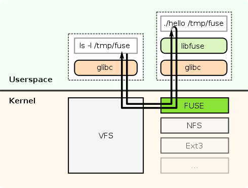

# sisop-modul-4
Modul 4 mata kuliah sistem operasi Teknik Informatika ITS

# File System in User Space (FUSE)
FUSE (Filesystem in Userspace) adalah sebuah _interface_ dimana kita dapat membuat _filesystem_ linux sendiri di _userspace_.

lalu apa yang menyenangkan dari membuat _filesystem_ sendiri di userspace? tentu saja menyenangkan dan merupakan suatu keuntungan yang besar, kita dapat menggunakan _library_ apapun yang tersedia untuk membuat sebuah _filesystem_ sendiri tanpa perlu mengganti kode pada kernel dan tanpa perlu mengerti secara mendalam apa yang _filesystem_ sebenarnya lakukan di _kernelspace_. hal ini dapat dilakukan karena adanya modul fuse yang **menjembatani** antara kode _filesystem_ yang berada di _userspace_ dengan _filesystem_ yang berada di _kernelspace_.

salah satu contoh yang menarik dari fuse adalah [GDFS][7bb7b7cc] (Google Drive File System) dimana GDFS ini memungkinkan kita untuk menunggangkan (mount) Google Drive kita ke sistem linux dan menggunakannya seperti file linux biasa.

  [7bb7b7cc]: https://github.com/robin-thomas/GDFS "GDFS"



Untuk mengimplementasikan FUSE ini, kita harus membuat sebuah program yang terhubung dengan *library* ```libfuse```. tujuan dari program yang dibuat ini adalah menspesifikkan bagaimana *filesystem* merespon *read/write/stat* dari sebuah *request*. program ini juga digunakan untuk menunggangkan *(mount)* *filesystem* asli *(kernelspace)* ke *filesystem* yang baru *(userspace)*. jadi disaat *user* berurusan dengan *read/write/stat request* di *filesystem (userspace)*, kernel akan meneruskan *input output request* tersebut ke program FUSE dan program tersebut akan merespon kembali ke *user*.

Untuk lebih jelasnya mari kita coba membuat program FUSE.

##### Instalasi FUSE
```
$ sudo apt update
$ sudo apt install libfuse*
```
##### Membuat Program FUSE
```
static struct fuse_operations xmp_oper = {
	.getattr	= xmp_getattr,
	.access		= xmp_access,
	.readlink	= xmp_readlink,
	.readdir	= xmp_readdir,
	.mknod		= xmp_mknod,
	.mkdir		= xmp_mkdir,
	.symlink	= xmp_symlink,
	.unlink		= xmp_unlink,
	.rmdir		= xmp_rmdir,
	.rename		= xmp_rename,
	.link		= xmp_link,
	.chmod		= xmp_chmod,
	.chown		= xmp_chown,
	.truncate	= xmp_truncate,
	.utimens	= xmp_utimens,
	.open		= xmp_open,
	.read		= xmp_read,
	.write		= xmp_write,
	.statfs		= xmp_statfs,
	.create         = xmp_create,
	.release	= xmp_release,
	.fsync		= xmp_fsync,
#ifdef HAVE_SETXATTR
	.setxattr	= xmp_setxattr,
	.getxattr	= xmp_getxattr,
	.listxattr	= xmp_listxattr,
	.removexattr	= xmp_removexattr,
#endif
};
```


# Dictionary
```
Kernel space is strictly reserved for running a privileged operating system kernel, kernel extensions, and most device drivers. In contrast,

user space is the memory area where application software and some drivers execute.
```
